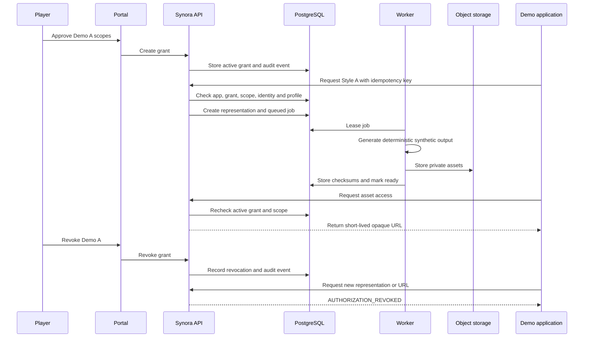

# Synthetic Representation Flow

```mermaid
sequenceDiagram
    participant P as Player
    participant W as Portal
    participant A as Synora API
    participant D as PostgreSQL
    participant J as Worker
    participant S as Object storage
    participant G as Demo application

    P->>W: Approve Demo A scopes
    W->>A: Create grant
    A->>D: Store active grant and audit event
    G->>A: Request Style A with idempotency key
    A->>D: Check app, grant, scope, identity and profile
    A->>D: Create representation and queued job
    J->>D: Lease job
    J->>J: Generate deterministic synthetic output
    J->>S: Store private assets
    J->>D: Store checksums and mark ready
    G->>A: Request asset access
    A->>D: Recheck active grant and scope
    A-->>G: Return short-lived opaque URL
    P->>W: Revoke Demo A
    W->>A: Revoke grant
    A->>D: Record revocation and audit event
    G->>A: Request new representation or URL
    A-->>G: AUTHORIZATION_REVOKED
```
