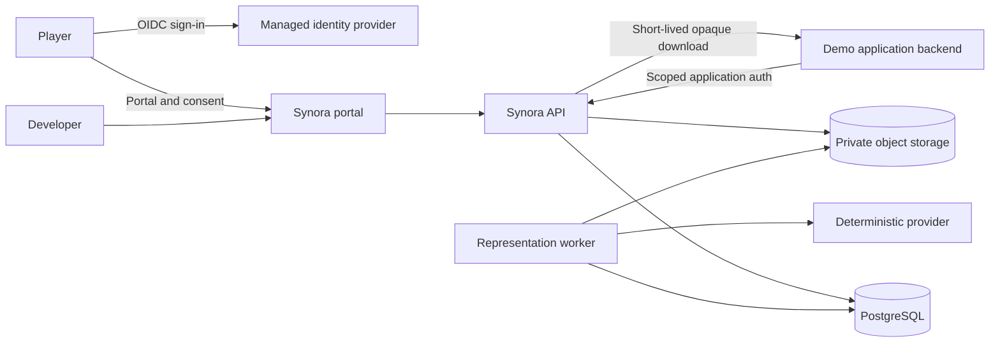

# System Boundaries

Trust boundaries:

- Browsers and demo clients are untrusted.
- The managed identity provider authenticates humans but does not own Synora grants.
- The API is the only public authority for grants and representation access.
- Storage and database identifiers remain internal.
- The deterministic provider accepts synthetic fixtures only.
